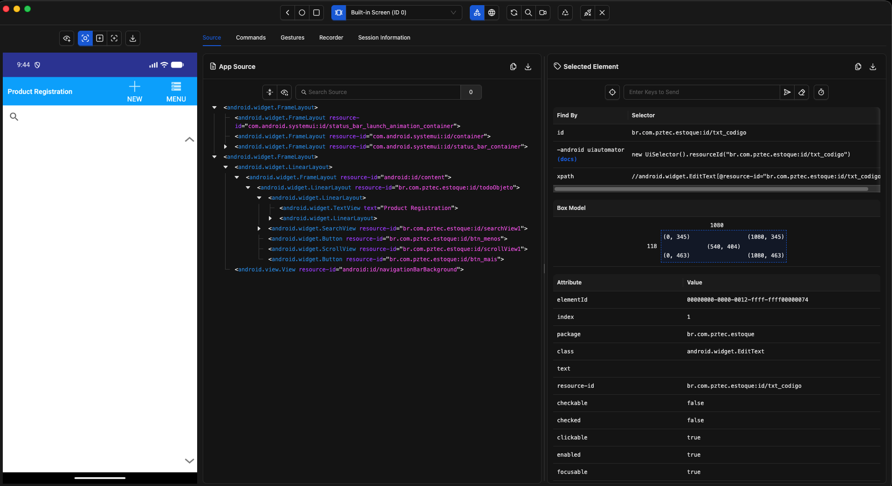

# Appium (Android) - POC

**Autor:** [Caio Cavalcanti](https://github.com/CesarImperas) - PDI @ VIRTUS UFCG  

<br>

> [!WARNING]
> **Status:** Suspensa
>
> A POC foi temporariamente interrompida devido à suspensão da prioridade de
automação mobile pelo cliente do projeto.
> 
> O trabalho foi encerrado após a configuração e validação do ambiente Appium, UiAutomator2, Android Emulator e Appium Inspector, incluindo a exploração da UI hierarchy e identificação inicial de locators da aplicação.
>
> A implementação dos **testes E2E** em **Java + Maven + JUnit 5** não foi realizada, pois essa etapa dependia da continuidade da demanda de automação mobile.

<br>

**Tópicos pendentes:**
- Criação dos primeiros scripts de testes automatizados, utilizando a linguagem escolhida e definida no Appium Client, junto com o seu framework para o desenvolvimento dos testes.

> Boa parte do material desenvolvido como estudo da ferramenta e outros assuntos relacinados, estão inteiros no **Obsidian** e podem ser consultados se solicitados pela autoria.

## Objetivo da POC

Avaliar o uso do **Appium para automação funcional/UI E2E de aplicações Android nativas**, com foco nos seguintes aspectos:

- Identificação e interação com elementos da interface;
- Estabilidade dos testes e ocorrência de flakiness;
- Sincronização e estratégias de espera;
- Organização e manutenibilidade da automação;
- Limitações encontradas durante a implementação;
- Viabilidade de integração futura com CI/CD.

> **Escopo:** esta POC utiliza **Appium** como ferramenta de automação E2E/UI. Testes instrumentados nativos, como Espresso, não fazem parte desta avaliação.

## Estrutura inicial do repositório

```text
appium-poc/
│
├── app/
│   └── appForTests.apk
│
├── src/
│   └── test/
│       └── java/
│           ├── pages/
│           ├── tests/
│           └── utils/
│
├── pom.xml
├── README.md
└── .gitignore
```

### Por que não criar `config/`, `drivers/`, `factories/`, `hooks/` etc. agora?

Porque ainda não sabemos se serão necessários.

Depois do primeiro teste, provavelmente teremos algo como:

```text
tests
  ↓
pages
  ↓
driver
  ↓
Appium Server
  ↓
UiAutomator2
  ↓
Android Emulator / Device
  ↓
Aplicação
```

> A estrutura será evoluída conforme as necessidades observadas nos testes. A intenção da POC é avaliar o Appium e sua manutenibilidade, não construir um framework abstrato por antecipação.

## Stack tecnológica da POC

| Componente           | Escolha                        |
| -------------------- | ------------------------------ |
| Linguagem            | **Java**                       |
| Build / dependências | **Maven**                      |
| Test runner          | **JUnit 5**                    |
| Automação            | **Appium**                     |
| Driver Android       | **UiAutomator2**               |
| Protocolo            | **WebDriver**                  |
| Android              | Android Studio + SDK           |
| Dispositivo          | Android Emulator / AVD         |
| APK                  | APK disponibilizado pelo curso |
| Inspector            | Appium Inspector               |
| IDE                  | VS Code / IntelliJ IDEA        |
| Versionamento        | Git                            |

## Pré-requisitos

Antes da execução dos testes, o ambiente deve disponibilizar:

- JDK;
- Node.js e npm;
- Android Studio e Android SDK;
- `adb`;
- Android Emulator / AVD;
- Appium Server;
- driver UiAutomator2;
- Appium Inspector;
- Maven;
- Git.

### Validação rápida do ambiente

```bash
java -version
node -v
npm -v

adb devices

appium --version
appium driver list --installed
```

O objetivo dessas verificações é confirmar o ambiente antes de investigar problemas relacionados ao próprio teste.

## Appium Inspector

O **Appium Inspector** é utilizado nesta POC para visualizar e explorar a interface da aplicação durante uma sessão Appium. Ele apresenta a captura da tela, a árvore da UI e os atributos dos elementos, permitindo investigar locators e interações antes de codificar os testes.

O Inspector é disponibilizado oficialmente como aplicação desktop para macOS, Windows e Linux. O download deve ser feito pela página oficial de releases do projeto.

### Fluxo de uso na POC

```text
Android Emulator / Device
          ↑
         ADB
          ↑
     UiAutomator2
          ↑
    Appium Server
          ↑
  Appium Inspector
```

A sequência prática é:

1. iniciar o Android Emulator / AVD;
2. confirmar o dispositivo com `adb devices`;
3. iniciar o Appium Server;
4. abrir o Appium Inspector;
5. criar uma sessão apontando para o servidor Appium;
6. informar as capabilities necessárias para o APK;
7. explorar a árvore da UI e os atributos dos elementos;
8. registrar os locators candidatos para o primeiro teste.

### Sessão inicial

Parâmetros esperados para o servidor local:

```text
Host: 127.0.0.1
Port: 4723
Path: /
```

Exemplo de capabilities para a aplicação da POC:

```json
{
  "platformName": "Android",
  "appium:automationName": "UiAutomator2",
  "appium:deviceName": "emulator-5554",
  "appium:app": "/caminho/absoluto/appium-poc/app/appForTests.apk"
}
```

> O `deviceName` deve ser ajustado para o identificador exibido pelo `adb devices`, e o caminho do APK deve ser absoluto na configuração da sessão do Inspector.

### Capabilities utilizadas nesta POC

| Capability | Valor inicial | Finalidade |
| ----------- | ------------- | ---------- |
| `platformName` | `Android` | Identifica a plataforma de automação. |
| `appium:automationName` | `UiAutomator2` | Define o driver utilizado pelo Appium para Android. |
| `appium:deviceName` | `Android Emulator` | Identificação descritiva do device no contexto da sessão. |
| `appium:udid` | `emulator-5554` | Seleciona explicitamente o emulador alvo. |
| `appium:app` | caminho absoluto do APK | Informa ao driver qual aplicação deve ser instalada/iniciada. |

A configuração inicial mantém somente as capabilities necessárias para abrir o APK. `appPackage`, `appActivity`, `noReset`, `autoGrantPermissions` e outras capabilities serão adicionadas somente se a execução demonstrar necessidade. O UiAutomator2 consegue detectar `appPackage` e `appActivity` a partir do APK em muitos cenários.

### Primeiro contato

Após iniciar a primeira sessão, a tela principal deve estar disposta dessa maneira abaixo, com base na versão instalada do Appium Inspector.



## Elementos e Locators

A investigação dos elementos deve priorizar atributos que representem o elemento de forma estável e significativa para o teste.

A POC utilizará inicialmente a seguinte **ordem de avaliação**, que será validada na prática e não tratada como regra universal:

1. **Accessibility ID**;
2. **Resource ID**;
3. **Locators específicos do Android**;
4. **XPath**.

O principal critério é a **manutenibilidade e estabilidade do locator**, e não apenas a facilidade de encontrá-lo no Inspector.

### Registro dos locators (Template)

Durante a inspeção, utilizando o aplicativo `product_registration.apk`, registrar os candidatos relevantes para cada elemento:

| Elemento | Accessibility ID | Resource ID | XPath | Observação |
| -------- | ---------------- | ----------- | ----- | ---------- |
| —        | —                | —           | —     | —          |

Esse registro serve como evidência da POC e ajuda a comparar as estratégias durante a implementação dos primeiros fluxos.

### Estados da UI observados

O `App Source` representa a hierarquia disponível no **estado atual da aplicação**. Após navegar da tela inicial para o cadastro de produto, a árvore observada mudou e passou a expor os elementos específicos dessa tela.

Durante a inspeção, também apareceram nós pertencentes ao **System UI** do Android, como `com.android.systemui`. Para a automação da aplicação, o foco deve permanecer nos elementos pertencentes ao pacote da aplicação sob teste, neste caso `br.com.pztec.estoque`.

#### Tela inicial - Product Registration

Elementos relevantes observados:

| Elemento | Classe | Resource ID | Observação |
| -------- | ----- | ----------- | ---------- |
| Título | `android.widget.TextView` | — | Texto: `Product Registration` |
| NEW | `android.widget.Button` | `br.com.pztec.estoque:id/Button1` | Navega para cadastro de produto |
| MENU | `android.widget.Button` | `br.com.pztec.estoque:id/Button3` | Botão de menu |
| Search | `android.widget.SearchView` | `br.com.pztec.estoque:id/searchView1` | Campo de busca |
| Menos | `android.widget.Button` | `br.com.pztec.estoque:id/btn_menos` | Botão de decremento |
| Scroll | `android.widget.ScrollView` | `br.com.pztec.estoque:id/scrollView1` | Área de rolagem |
| Mais | `android.widget.Button` | `br.com.pztec.estoque:id/btn_mais` | Botão de incremento |

#### Tela de cadastro - Product

Elementos relevantes observados:

| Elemento | Classe | Resource ID | Observação |
| -------- | ----- | ----------- | ---------- |
| Code | `android.widget.EditText` | `br.com.pztec.estoque:id/txt_codigo` | Campo de código |
| Description | `android.widget.EditText` | `br.com.pztec.estoque:id/txt_descricao` | Campo de descrição |
| Packing | `android.widget.EditText` | `br.com.pztec.estoque:id/txt_unidade` | Campo de unidade/embalagem |
| Amount | `android.widget.EditText` | `br.com.pztec.estoque:id/txt_quantidade` | Campo de quantidade |
| Unit value | `android.widget.EditText` | `br.com.pztec.estoque:id/txt_valunit` | Campo de valor unitário |
| Lot | `android.widget.EditText` | `br.com.pztec.estoque:id/txt_lote` | Campo de lote |
| Expiration date | `android.widget.TextView` | `br.com.pztec.estoque:id/data` | Data observada: `2026-09-18` |
| SAVE | `android.widget.Button` | `br.com.pztec.estoque:id/btn_gravar_assunto` | Botão de salvamento |

### Avaliação inicial dos locators

Na exploração realizada, **não foram observados Accessibility IDs/content-desc relevantes** nos elementos selecionados. Em contrapartida, a aplicação expõe diversos `resource-id` específicos e legíveis o suficiente para uma primeira estratégia de automação.

Exemplos de XPath candidatos, derivados dos `resource-id` observados:

```xpath
//android.widget.EditText[@resource-id="br.com.pztec.estoque:id/txt_codigo"]
//android.widget.Button[@resource-id="br.com.pztec.estoque:id/btn_gravar_assunto"]
```

Esses XPaths são registrados como **alternativas**, não como primeira escolha. O próximo passo da POC será validar esses locators no código Java e observar seu comportamento durante execuções repetidas.

### Atualização do registro de locators

| Elemento | Accessibility ID | Resource ID | XPath candidato | Observação |
| -------- | ---------------- | ----------- | --------------- | ---------- |
| NEW | — | `br.com.pztec.estoque:id/Button1` | `//android.widget.Button[@resource-id="br.com.pztec.estoque:id/Button1"]` | ID direto; nomenclatura pouco semântica |
| MENU | — | `br.com.pztec.estoque:id/Button3` | `//android.widget.Button[@resource-id="br.com.pztec.estoque:id/Button3"]` | ID direto; nomenclatura pouco semântica |
| Code | — | `br.com.pztec.estoque:id/txt_codigo` | `//android.widget.EditText[@resource-id="br.com.pztec.estoque:id/txt_codigo"]` | ID específico e semântico |
| Description | — | `br.com.pztec.estoque:id/txt_descricao` | `//android.widget.EditText[@resource-id="br.com.pztec.estoque:id/txt_descricao"]` | ID específico e semântico |
| Unit value | — | `br.com.pztec.estoque:id/txt_valunit` | `//android.widget.EditText[@resource-id="br.com.pztec.estoque:id/txt_valunit"]` | ID específico |
| Lot | — | `br.com.pztec.estoque:id/txt_lote` | `//android.widget.EditText[@resource-id="br.com.pztec.estoque:id/txt_lote"]` | ID específico |
| SAVE | — | `br.com.pztec.estoque:id/btn_gravar_assunto` | `//android.widget.Button[@resource-id="br.com.pztec.estoque:id/btn_gravar_assunto"]` | ID específico e legível |

> A classificação de estabilidade acima é inicial e será confirmada somente após a implementação e execução dos testes.

## Execução esperada da automação

```text
JUnit 5
   ↓
Appium Java Client
   ↓
Appium Server
   ↓
UiAutomator2 Driver
   ↓
ADB
   ↓
Android Emulator / Device
   ↓
Appium App
```

O **Appium Java Client** será a biblioteca utilizada pelo código Java para estabelecer a sessão e enviar os comandos de automação ao Appium Server.

## Critérios de avaliação

Os resultados da POC devem registrar evidências sobre:

| Critério | O que observar |
| -------- | -------------- |
| Elementos | facilidade de inspeção e disponibilidade de atributos estáveis |
| Locators | clareza, estabilidade e acoplamento à implementação da UI |
| Sincronização | necessidade de waits e comportamento em diferentes tempos de resposta |
| Estabilidade | falhas intermitentes e necessidade de retries |
| Manutenibilidade | facilidade para alterar fluxos e elementos |
| Execução | tempo e comportamento durante os testes |
| Limitações | problemas encontrados no Appium, driver ou ambiente |
| CI/CD | requisitos e dificuldades para uma execução futura em pipeline |

## Roadmap da POC (~1 semana)

| Etapa | Foco | Status |
| ----- | ---- | ------ |
| Day 1 | Ambiente Android Studio / SDK / Emulator | ✅ Concluído |
| Day 2 | Appium Server + UiAutomator2 + validação do ambiente | ✅ Concluído |
| Day 3 | Primeiro contato com Appium Inspector | ✅ Concluído |
| Day 4 | Elementos e Locators | ✅ Concluído |
| Day 5 | Fluxos reais e primeiro teste | 🔄 Em andamento |
| Day 6 | Estrutura do framework | ⏳ Próximo |
| Day 7 | Consolidação, limitações e resultados | ⏳ Próximo |

## Referências

- [Appium Documentation](https://appium.io/docs/)
- [Appium Inspector](https://github.com/appium/appium-inspector)
- [Appium Inspector Releases](https://github.com/appium/appium-inspector/releases)
- [Appium Java Client](https://github.com/appium/java-client)
- [UiAutomator2 Driver](https://appium.io/docs/en/latest/quickstart/uiautomator2-driver/)
